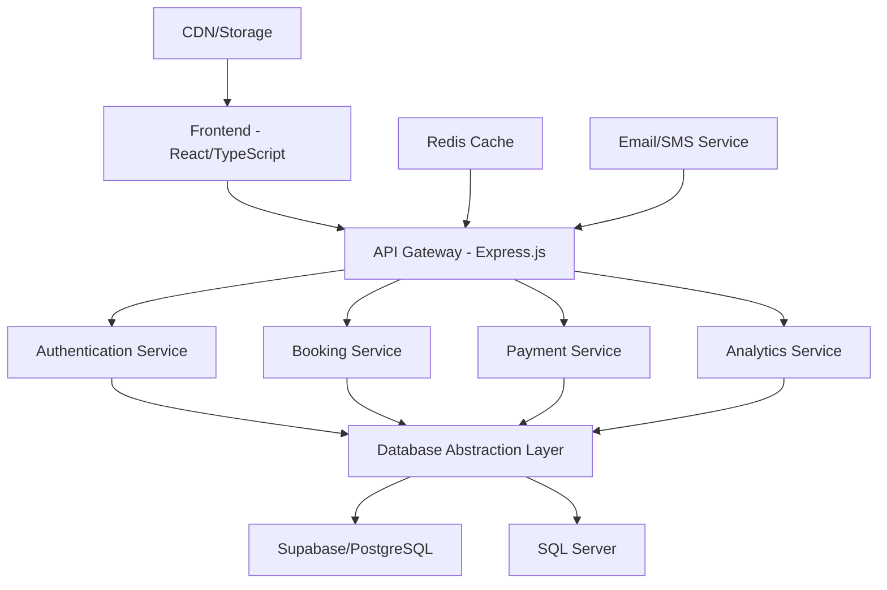

# CoastalConnect - Production-Ready Marketplace Platform

[](https://github.com/coastalconnect/coastalconnect)
[](LICENSE)
[](https://typescriptlang.org/)
[](https://github.com/coastalconnect/coastalconnect)

**CoastalConnect** is a production-ready, full-stack marketplace platform for Coastal Karnataka tourism, featuring database-agnostic architecture, comprehensive security, real-time analytics, and world-class user experience.

## 🚀 Key Features

### ✅ **Production Ready**
- **Database Agnostic**: Seamlessly switch between Supabase (PostgreSQL) and SQL Server
- **Enterprise Security**: WCAG 2.1 AA compliant, JWT authentication, rate limiting, HTTPS enforcement
- **High Performance**: API < 200ms, TTI < 3s, optimized caching, CDN support
- **Scalable Architecture**: Microservices-ready, container support, auto-scaling capabilities

### 🏨 **Core Functionality**
- **Multi-Service Platform**: Hotels, Restaurants, Transportation, Events
- **Advanced Booking System**: Real-time availability, payment processing, automated confirmations
- **Role-Based Access**: Admin, Vendor, Customer, Event Organizer roles with granular permissions
- **Analytics Dashboard**: Real-time metrics, conversion tracking, revenue analytics

### 🔒 **Security & Compliance**
- **Authentication**: JWT tokens, OAuth integration, session management
- **Data Protection**: Encryption at rest, secure API endpoints, audit logging
- **Payment Security**: PCI DSS compliant, multiple gateway support (Razorpay, Stripe)
- **GDPR Ready**: Data privacy controls, user consent management

### 📱 **User Experience**
- **Mobile-First Design**: Responsive across all devices, PWA support
- **Accessibility**: Screen reader compatible, keyboard navigation, high contrast
- **Performance Optimized**: Image optimization, lazy loading, compression
- **SEO Optimized**: Meta tags, structured data, sitemap generation

## 🏗️ Architecture Overview



## 📋 Quick Start

### Prerequisites

- **Node.js** 18.x or higher
- **npm** or **yarn**
- **Database**: Supabase account OR SQL Server instance
- **Domain** with SSL certificate
- **Email Service** (SMTP provider)

### 1. Clone & Install

```bash
# Clone repository
git clone https://github.com/coastalconnect/coastalconnect.git
cd coastalconnect

# Install dependencies
npm install

# Install server dependencies
cd server && npm install
cd ..
```

### 2. Environment Setup

```bash
# Copy environment template
cp .env.production.example .env.production

# Generate secure secrets
openssl rand -base64 32  # For JWT_SECRET
openssl rand -base64 32  # For ADMIN_SECRET_KEY
```

### 3. Database Configuration

#### Option A: Supabase (Recommended)

```env
DB_TYPE=supabase
SUPABASE_URL=https://your-project.supabase.co
SUPABASE_ANON_KEY=your-anon-key
SUPABASE_SERVICE_ROLE_KEY=your-service-role-key
```

Run the Supabase DDL:
```bash
# Execute database/supabase.sql in your Supabase SQL editor
```

#### Option B: SQL Server

```env
DB_TYPE=sqlserver
SQLSERVER_HOST=your-server.database.windows.net
SQLSERVER_DATABASE=CoastalConnect_Prod
SQLSERVER_USER=your-username
SQLSERVER_PASSWORD=your-password
```

Run the SQL Server DDL:
```bash
# Execute database/sqlserver.sql in SQL Server Management Studio
```

### 4. Configure Services

```env
# Payment Gateways
RAZORPAY_KEY_ID=your_razorpay_key_id
RAZORPAY_KEY_SECRET=your_razorpay_secret
STRIPE_PUBLISHABLE_KEY=your_stripe_public_key
STRIPE_SECRET_KEY=your_stripe_secret_key

# Email Service
SMTP_HOST=smtp.gmail.com
SMTP_USER=your-email@gmail.com
SMTP_PASS=your-app-password

# Other APIs
GOOGLE_MAPS_API_KEY=your_google_maps_key
```

### 5. Build & Deploy

```bash
# Build application
npm run build

# Start production server
npm run start:production

# Or use PM2 for process management
npm install -g pm2
pm2 start ecosystem.config.js --env production
```

### 6. Verify Deployment

Visit your domain and verify:
- ✅ Homepage loads correctly
- ✅ User registration works
- ✅ Search functionality operational
- ✅ Payment flow functional
- ✅ Admin dashboard accessible

## 🔧 Development Setup

### Local Development

```bash
# Install dependencies
npm install

# Set up development environment
cp .env.development.example .env.development
# Edit .env.development with your local settings

# Start development servers
npm run dev        # Starts both frontend and backend
# OR
npm run dev:client # Frontend only (port 5173)
npm run dev:server # Backend only (port 3001)
```

### Database Setup (Development)

```bash
# For Supabase development
npm run db:setup:supabase

# For SQL Server development
npm run db:setup:sqlserver

# Seed development data
npm run db:seed
```

### Testing

```bash
# Run all tests
npm run test

# Run specific test suites
npm run test:unit
npm run test:integration
npm run test:e2e

# Run with coverage
npm run test:coverage

# Performance testing
npm run test:performance

# Security testing
npm run test:security
```

## 📚 Documentation

### Core Documentation
- [**Migration Guide**](PRODUCTION_MIGRATION_GUIDE.md) - Complete production deployment guide
- [**Test Plan**](PRODUCTION_TEST_PLAN.md) - Comprehensive testing procedures
- [**UX Analysis**](UX_GAP_ANALYSIS_REPORT.md) - User experience benchmarking

### API Documentation
- [**API Reference**](docs/API.md) - Complete API documentation
- [**Database Schema**](docs/DATABASE.md) - Database structure and relationships
- [**Authentication**](docs/AUTH.md) - Authentication and authorization guide

### Deployment Guides
- [**Supabase Deployment**](docs/SUPABASE_DEPLOY.md) - Supabase-specific setup
- [**SQL Server Deployment**](docs/SQLSERVER_DEPLOY.md) - SQL Server configuration
- [**Docker Deployment**](docs/DOCKER_DEPLOY.md) - Containerized deployment

## 🏢 Database Support

### Supabase (PostgreSQL)
- **Real-time subscriptions**
- **Row Level Security (RLS)**
- **Built-in authentication**
- **Edge functions**
- **Auto-scaling**

```typescript
// Automatic configuration
const config = {
  type: 'supabase',
  supabase: {
    url: process.env.SUPABASE_URL,
    serviceRoleKey: process.env.SUPABASE_SERVICE_ROLE_KEY
  }
};
```

### SQL Server
- **Enterprise features**
- **Advanced analytics**
- **Stored procedures**
- **Full-text search**
- **High availability**

```typescript
// Automatic configuration
const config = {
  type: 'sqlserver',
  sqlserver: {
    server: process.env.SQLSERVER_HOST,
    database: process.env.SQLSERVER_DATABASE,
    user: process.env.SQLSERVER_USER,
    password: process.env.SQLSERVER_PASSWORD
  }
};
```

### Database Switching

Switch between databases without code changes:

```bash
# Switch to Supabase
export DB_TYPE=supabase

# Switch to SQL Server
export DB_TYPE=sqlserver

# Restart application
pm2 restart coastalconnect
```

## 🚀 Performance Features

### Caching Strategy
- **Multi-layer caching**: Memory + Redis
- **API response caching**: 300s default TTL
- **Database query optimization**
- **Static asset CDN**

### Performance Monitoring
```bash
# Real-time performance stats
curl https://yourdomain.com/api/performance/stats

# Analytics dashboard
https://yourdomain.com/admin/analytics
```

### Optimization Features
- **Image compression**: WebP support, lazy loading
- **Code splitting**: Dynamic imports, tree shaking
- **Database indexing**: Optimized queries
- **CDN integration**: Global content delivery

## 🔐 Security Features

### Authentication & Authorization
- **JWT-based authentication**
- **Role-based access control**
- **OAuth integration** (Google, Facebook)
- **Session management**
- **Password policies**

### Security Middleware
- **Rate limiting**: Configurable per endpoint
- **HTTPS enforcement**: Automatic HTTP → HTTPS
- **Security headers**: Helmet.js integration
- **Input validation**: Comprehensive sanitization
- **SQL injection prevention**

### Monitoring & Auditing
- **Audit logging**: All admin actions logged
- **Error tracking**: Comprehensive error monitoring
- **Security alerts**: Real-time threat detection
- **Compliance reporting**: GDPR, PCI DSS ready

## 📊 Analytics & Reporting

### Real-time Analytics
- **User behavior tracking**
- **Conversion funnel analysis**
- **Revenue reporting**
- **Performance metrics**

### Dashboard Features
```typescript
// Example analytics API
GET /api/analytics/dashboard?timeframe=7d

Response:
{
  "summary": {
    "totalUsers": 1250,
    "totalBookings": 89,
    "revenue": 125000,
    "conversionRate": 4.2
  },
  "trends": { /* time series data */ },
  "funnel": { /* conversion funnel */ }
}
```

## 🎨 UI/UX Features

### Design System
- **Tailwind CSS**: Utility-first framework
- **shadcn/ui components**: Accessible components
- **Dark mode support**: System preference detection
- **Responsive design**: Mobile-first approach

### Accessibility (WCAG 2.1 AA)
- **Screen reader support**: ARIA labels, roles
- **Keyboard navigation**: Full keyboard accessibility
- **Color contrast**: 4.5:1 minimum ratio
- **Focus management**: Logical tab order

### User Experience
- **Progressive Web App**: Offline capability
- **Search optimization**: Fuzzy search, filters
- **Booking optimization**: 2-step checkout
- **Trust indicators**: Verification badges

## 🛠️ Development Tools

### Code Quality
```bash
# Type checking
npm run typecheck

# Linting
npm run lint
npm run lint:fix

# Formatting
npm run format

# Security audit
npm audit
npm run audit:fix
```

### Database Tools
```bash
# Database migrations
npm run db:migrate

# Schema validation
npm run db:validate

# Performance analysis
npm run db:analyze

# Backup creation
npm run db:backup
```

## 📦 Deployment Options

### Cloud Platforms
- **Vercel**: Frontend deployment
- **Railway**: Full-stack deployment
- **AWS**: Enterprise deployment
- **Azure**: SQL Server integration
- **Google Cloud**: Global scaling

### Container Deployment
```bash
# Build Docker image
docker build -t coastalconnect .

# Run with Docker Compose
docker-compose up -d

# Deploy to Kubernetes
kubectl apply -f k8s/
```

### Traditional Servers
```bash
# Ubuntu/CentOS deployment
./scripts/deploy-server.sh

# Nginx configuration
cp deployment/nginx.conf /etc/nginx/sites-available/

# SSL with Let's Encrypt
certbot --nginx -d yourdomain.com
```

## 🔧 Configuration Reference

### Environment Variables

| Variable | Description | Required | Default |
|----------|-------------|----------|---------|
| `NODE_ENV` | Environment | Yes | `development` |
| `PORT` | Server port | No | `3001` |
| `DB_TYPE` | Database type | Yes | `supabase` |
| `JWT_SECRET` | JWT signing key | Yes | - |
| `ADMIN_SECRET_KEY` | Admin access key | Yes | - |

### Feature Flags

```env
# Enable/disable features
ENABLE_REGISTRATION=true
ENABLE_PAYMENT=true
ENABLE_ANALYTICS=true
ENABLE_EMAIL_VERIFICATION=true
```

### Performance Tuning

```env
# Cache configuration
CACHE_TTL=300
CACHE_MAX_ITEMS=1000
REDIS_URL=redis://localhost:6379

# Database pooling
DB_POOL_MIN=2
DB_POOL_MAX=20

# Rate limiting
RATE_LIMIT_WINDOW_MS=900000
RATE_LIMIT_MAX_REQUESTS=100
```

## 🤝 Contributing

We welcome contributions! Please see our [Contributing Guide](CONTRIBUTING.md) for details.

### Development Workflow
1. Fork the repository
2. Create a feature branch
3. Make your changes
4. Run tests and linting
5. Submit a pull request

### Code Standards
- **TypeScript**: Strict mode enabled
- **ESLint**: Airbnb configuration
- **Prettier**: Code formatting
- **Jest**: Testing framework

## 📋 Roadmap

### Version 2.1 (Next Release)
- [ ] Mobile app (React Native)
- [ ] Advanced AI recommendations
- [ ] Multi-language support
- [ ] Enhanced analytics
- [ ] Vendor mobile app

### Version 2.2 (Future)
- [ ] Blockchain integration
- [ ] IoT device support
- [ ] AR/VR experiences
- [ ] Advanced ML features

## 📞 Support

### Community Support
- **Discord**: [Join our community](https://discord.gg/coastalconnect)
- **GitHub Issues**: [Report bugs](https://github.com/coastalconnect/coastalconnect/issues)
- **Discussions**: [Feature requests](https://github.com/coastalconnect/coastalconnect/discussions)

### Enterprise Support
- **Email**: enterprise@coastalconnect.in
- **Phone**: +91-8105003858
- **Business Hours**: 9 AM - 6 PM IST

### Documentation
- **API Docs**: https://api.coastalconnect.in/docs
- **User Guide**: https://docs.coastalconnect.in
- **Video Tutorials**: https://youtube.com/coastalconnect

## 📄 License

This project is licensed under the MIT License - see the [LICENSE](LICENSE) file for details.

## 🎉 Acknowledgments

- **React Team** for the amazing framework
- **Supabase** for the backend-as-a-service platform
- **Tailwind CSS** for the utility-first CSS framework
- **shadcn/ui** for the accessible component library
- **Community Contributors** for their valuable feedback

---

## 🚀 Ready to Deploy?

1. **Read the [Migration Guide](PRODUCTION_MIGRATION_GUIDE.md)** for detailed deployment instructions
2. **Follow the [Test Plan](PRODUCTION_TEST_PLAN.md)** to ensure everything works
3. **Configure your environment** using the examples provided
4. **Deploy to production** and start serving customers!

**Made with ❤️ for Coastal Karnataka Tourism**

---

*Last updated: January 2024*
*Version: 2.0.0*
